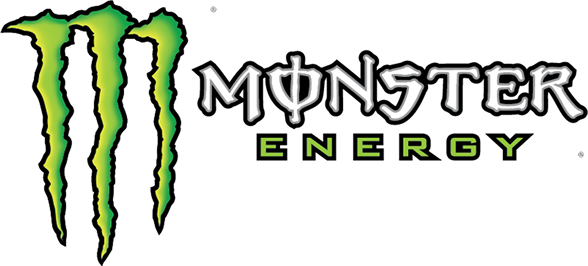

# REMODEL site da MONSTER ENERGY

> Um cara tentando remodelar o site da marca de energéticos MONSTER ENERGY (talvez fique feio 😋)

### Ajustes e melhorias

O projeto ainda está em desenvolvimento e as próximas atualizações serão voltadas para as seguintes tarefas:

- [ ] Todo HTML 😎
- [ ] Todo CSS 😍
- [ ] API fake dos Produtos 🤓
- [ ] Todo JavaScript 🥵
- [ ] Todo GSAP 😱
- [ ] Responsividade ☠️
